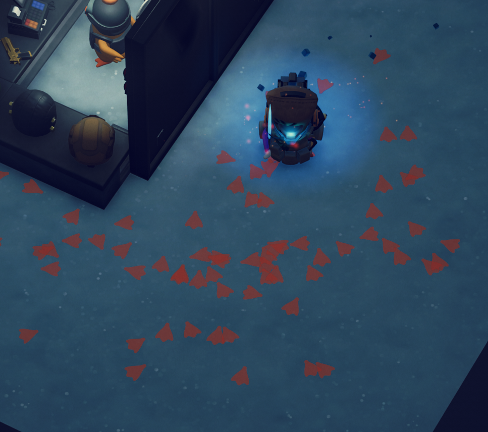

# Duck Tracks

**English** · [한국어](README.ko.md) · [简体中文](README.zh.md)

Footprints that stay where you walked, in **Escape from Duckov**. Not spaced by distance — stamped at the moment a foot actually lands, in the shape of the foot your character is actually wearing.

[](https://steamcommunity.com/sharedfiles/filedetails/?id=3786388428)
[](LICENSE)



---

## Features

**Stamped on the real step** — The mod watches the height of the foot bones every frame and stamps only on the landing transition. Stand still and nothing appears. Run and the prints spread out. Left and right alternate because they are literally the left and right foot.

**The shape of your actual foot** — By default the print is a silhouette of the foot the character is wearing, lifted from the model itself. Change footwear and the print changes with it. Its size is measured from the real foot too.

**21 built-in prints** — duck, bear, cat, dog, wolf, bird, chicken, horse hoof, cow hoof, deer, bare foot, boot, sneaker, rabbit, lizard, frog, dinosaur, paw, heart, star, tyre tread.

**Your own images** — Drop a PNG into the folder and it appears in the picker. `Rescan folder` picks it up without restarting.

**Draw your own** — A grid you paint by hand. Edges are smoothed when the shape is baked, so 24 cells is enough to come out clean.

**Random footprint** — Not a random blob. Parameters are drawn from a grammar of pad, toes, claws, webbing and cleft, so what comes out is always foot-shaped.

**Colour** — Two colours (freshly stamped, and as it fades) from a saturation/value square, hue bar, or an exact HEX / R,G,B value. Paint over the ground like dirt, or glow in the dark with an adjustable strength.

**Blinking and colour cycling** — Brightness pulses and hue rotates. Both are driven by each print's own age, so the effect travels along the trail as a wave rather than flashing the whole screen at once.

**Step particles** — Particles kick up when you land, and drift up gently from prints still on the ground. Shape, colour and lifetime are shared between the two so they read as one family.

**Lifetime** — Seconds, or `Keep forever` so prints never fade and the count cap is lifted.

Everything lives under `Footprint Settings` in the pause menu, in English, Korean, Simplified and Traditional Chinese.

## How it works

Four things about this game shaped the implementation.

| Problem | What the code does |
|---|---|
| `CharacterModel` exposes sockets for hands, armour, helmet, face, backpack and melee weapon — but **no foot socket** | Walks the model tree for the `Foot.L` / `Foot.R` bones by name, and takes the foot's facing from the bone→tip vector rather than the bone's local axes, which are a rigging convention and cannot be trusted |
| Foot meshes have `isReadable = false`, so vertices cannot be read on the CPU | The silhouette is **rendered, not computed** — the mesh is placed far below the map, photographed once by an orthographic camera looking straight down, and read back. The GPU never needed CPU access |
| `colorOverLifetime` gradients hold at most 8 keys, so a travelling pulse cannot be expressed over a long lifetime — and not at all over an unlimited one | Particle colours are written individually from **each particle's own age**. Phase offsets fall out of the stamp times for free, which is what makes the pulse travel along the trail |
| A "forever" lifetime of 10⁶ seconds silently froze that age arithmetic | Float ULP at 10⁶ is 0.0625 s — larger than a frame, so `remainingLifetime -= deltaTime` never landed and every age stayed 0. Capped at 36 000 s, where ULP is 0.004 s and a frame fits four times over |

Two smaller notes. The stamps are `HorizontalBillboard` particles rather than the usual camera-facing ones, which is the single line that makes them lie on the ground instead of standing up like cards in a top-down view. And the pulse work is skipped entirely when the renderer reports `isVisible == false`, because reading and rewriting every live particle costs in proportion to their number, and unlimited lifetime can mean thousands of them across a map.

## Building

Needs the .NET SDK and a copy of the game.

```
cp Local.props.example Local.props     # point SteamFolder at your install
dotnet build -c Release
```

The Ducky SDK copies the built mod into the game's `Mods` folder. `0Harmony.dll` is copied separately after that, because the SDK wipes and rebuilds the mod folder first — see the comment in `DuckTracks.csproj` for why the version has to match exactly and why the reference assembly is the wrong file to grab.

Harmony is used for exactly one thing: making the game behave as paused while the settings window is open. The mod otherwise intercepts nothing and reads the character's position each frame.

## License

MIT — see [LICENSE](LICENSE) and [NOTICE.md](NOTICE.md).
